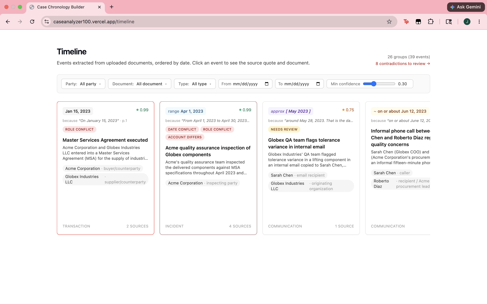
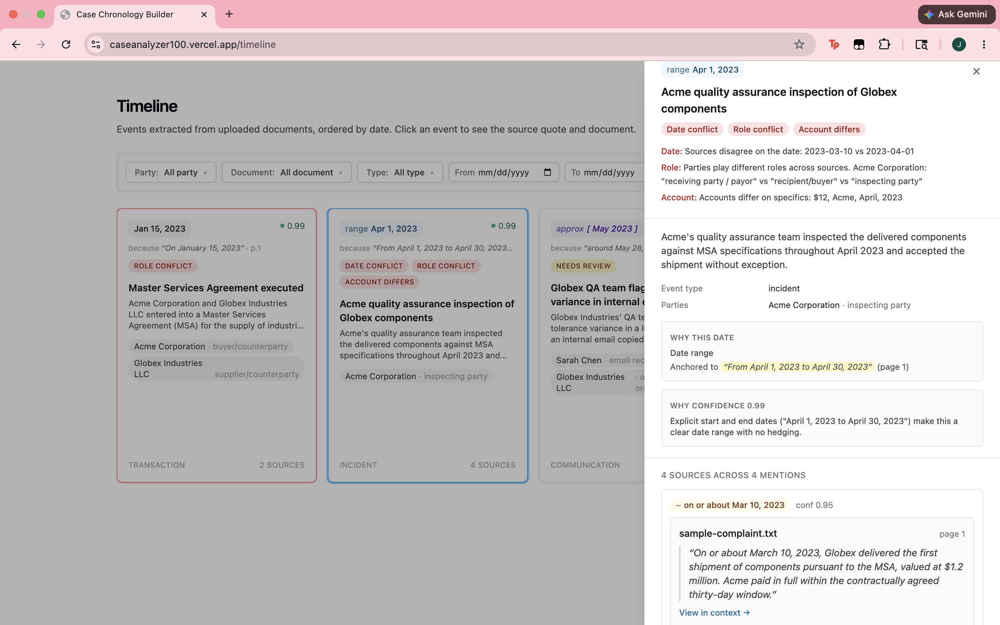
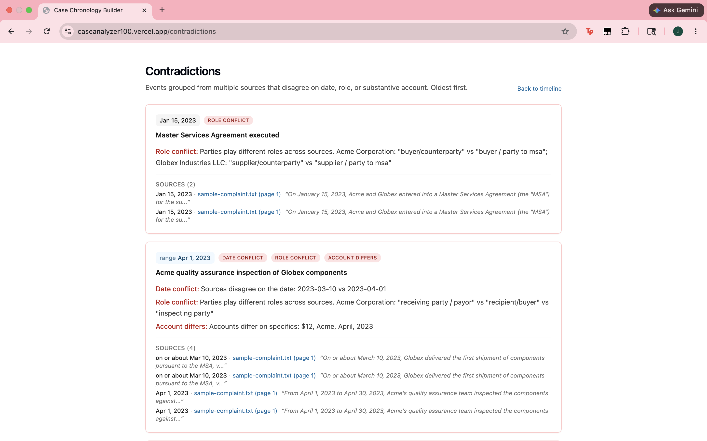
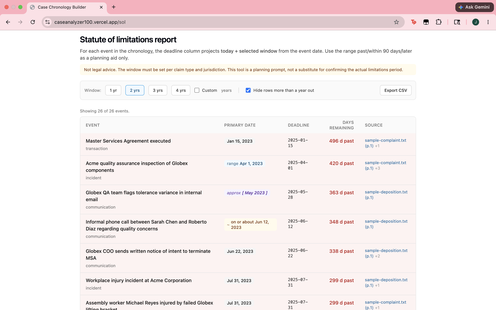

# Case Chronology Builder

A small tool for litigation paralegals. Drop in the documents that make up a case (complaints, depositions, medical records, letters), and get back a timeline of dated events where every claim is one click from the verbatim quote that supports it.

**Live demo:** https://caseanalyzer100.vercel.app · **Repo:** https://github.com/jmas123/case_chronology



The point of the project is not "AI reads documents." The point is the rule below.

## The one product decision

**A claim that cannot be sourced is not a claim.**

Paralegals already do this work by hand. The thing that makes it painful is not the reading. It is the second pass, weeks later, when an attorney asks "where did the November 7 date come from" and the paragraph has to be hunted down across 400 pages. Most "AI summarizes your documents" tools make that part worse: they generate prose that sounds confident and cannot be traced.

So the rule for this tool is: every event in the UI is backed by at least one `Source` row containing a verbatim quote, page number, character range, and document id. If the agent cannot anchor an event to a quote, the event is rejected, not surfaced with low confidence and a vibe.

That rule shows up in three layers so it cannot be quietly broken:

1. **DB.** Insertion of an `events` row is wrapped in a transaction with its `sources` rows. If the source insert fails, the event insert rolls back. The persistence helper raises `ValueError` when handed an event with zero sources. ([`api/app/repo.py`](api/app/repo.py))
2. **API.** `GET /events` joins through `sources` and drops any event with zero matches defensively, so a hand-edited DB cannot leak orphans to the client. ([`api/app/routers/events.py`](api/app/routers/events.py), [`api/app/repo.py`](api/app/repo.py))
3. **UI.** `Event.sources` is typed `[Source, ...Source[]]` in TypeScript, so a sourceless event is a compile error before it ever reaches a React component. ([`shared/types.ts`](shared/types.ts))

Clicking any card opens a right-side drawer with the quote, the page, the filename, and a "View in context" link that deep-links to a document viewer with the quoted span wrapped in `<mark>`. That click path is the product.



## What's in the box

| Surface | Path | What it does |
|---|---|---|
| Upload | `/documents` | Drag in `.pdf` / `.docx` / `.txt`. Validates extension and size. Surfaces a real warning for scanned PDFs with no text layer (instead of silently returning an empty extraction). |
| Extract | button per row | Runs the Anthropic extraction agent synchronously and persists events with sources. Shows "Extracted N events" inline, with a "Re-extract" affordance. |
| Timeline | `/timeline` | Custom horizontal scroll, no library. Date precision is rendered visually: exact dates render plain, "on or about" gets a tilde, ranges get a span, "spring 2024" gets a soft bracket. Confidence shows as a colored dot plus the numeric. |
| Filtering | URL-encoded | Party, document, event type (multi-select), date range, minimum confidence. Default confidence floor is `0.3` so the timeline opens to signal, not noise. Every change rewrites the URL so a paralegal can paste a filtered view to an attorney. |
| Conflict + duplicate handling | timeline cards | Events that share a party and have similar titles are grouped. Same date across the group → green "×N" duplicate badge (collapses the noise, shows combined sources). Different dates → red "Conflict (N)" badge with both dates side by side in the drawer. The bias is toward grouping, on the principle that a surfaced false-positive is cheaper than a hidden real conflict. |
| Source drawer | click any card | Quote, page, filename, plus "View in context" linking to `/documents/{id}/view?page=&start=&end=` with the span highlighted on the original text. Esc closes; focus returns to the triggering card. |
| Contradictions report | `/contradictions` | Every group with at least one contradiction, oldest first, with kind pills (date, role, account) and per-kind summaries. The page a paralegal opens before a deposition. |
| Statute-of-limitations | `/sol` | Window selector (1y to 4y or custom), per-event `deadline = primary.date + window` and `days_remaining = deadline - today`. Red for past, amber for ≤ 90 days. CSV export of the visible rows. Header disclaimer that the window must be set per claim and jurisdiction. |





## How the agent is built (and where I did not trust it)

The extraction agent uses Anthropic's tool-use loop with two tools, `record_event` and `finish`, defined in [`api/app/agent/tools.py`](api/app/agent/tools.py). The system prompt is versioned with a constant ([`api/app/agent/prompts.py`](api/app/agent/prompts.py)) so a prompt change leaves a fingerprint on every extraction batch.

Two things in the loop are worth calling out, because they came from running it for real, not from the design doc:

1. **The model is bad at character offsets.** First live run, every event got rejected because `chunk[start:end]` did not match `source_quote`. So the server now treats the model's `source_char_start` / `source_char_end` as hints and recomputes the true offsets via `chunk.find(source_quote)`. The verbatim check is on the quote itself, which the model can produce reliably. Bumped `PROMPT_VERSION` to `2026-05-24.v2` to record the contract change. ([`api/app/agent/extractor.py`](api/app/agent/extractor.py))
2. **Bounded correction.** A quote that genuinely is not in the chunk gets one corrective turn explaining the mismatch, capped at `MAX_CORRECTIVE_TURNS = 2`. If the model can't recover, it's told to call `finish` and the event is dropped. The agent loop never spirals.

The Anthropic client is injected via a FastAPI `Depends` so tests drive the loop with canned responses and never burn real credits. The five agent tests in [`api/tests/test_agent.py`](api/tests/test_agent.py) cover the verifiability rule, party deduplication, the corrective-turn path, and a happy-path roundtrip end-to-end.

## Engineering choices worth defending

- **Pydantic v2 is the source of truth.** `shared/types.ts` mirrors it. A schema change touches one file, then a sibling, with a header comment naming the source. Avoids drift; no codegen yet (one repo, two languages, not worth the build complexity).
- **Date precision is a first-class enum, not a confidence number.** `exact | on_or_about | range | approximate`. "April 2024" is not low-confidence; it is precisely a month. The UI renders each precision distinctly. The agent is instructed to use `approximate` for season/month-only language and resolve the `date` field to the first day of the period.
- **Events are the data model; groups are a view.** Conflict and duplicate detection happens client-side in [`web/lib/grouping.ts`](web/lib/grouping.ts) over the raw event list. Re-tuning the title-similarity threshold does not require a re-extract. When a second consumer (mobile, export, batch report) appears, this is the part that moves to the API.
- **Filters live in the URL.** `useSearchParams` + `router.replace`. Empty params don't pollute the bar (an unchanged confidence floor doesn't write `?min_conf=0.30` to the URL). Shareable views matter for FDE work: "the December chronology against just the deposition" is a link, not a screenshot.
- **CORS, ports, and env loading are honest.** `--env-file` flag documented because the API key would otherwise live in shell history; `localhost:3001` is in the CORS allowlist alongside `3000` because Next falls back to it when something else owns 3000. Small things, but they're the friction someone hits in the first ten minutes.

## Extraction eval (current numbers)

This is how I'd know if a prompt change regressed in production. Hand-labeled gold sets live in [`api/evals/cases/`](api/evals/cases/), one JSON per sample document. `python -m app.evals run` extracts each case with the current `PROMPT_VERSION`, matches predicted events to gold (party-overlap ≥ 1 AND date agreement, with title Jaccard used only as a tie-breaker; metric definitions in [ARCHITECTURE.md](ARCHITECTURE.md)), and writes a per-version JSON report.

Latest run on `claude-sonnet-4-6`, prompt `2026-05-24.v2`:

| Case | TP | FP | FN | Precision | Recall |
|---|---:|---:|---:|---:|---:|
| sample-complaint.txt | 9 | 0 | 0 | 1.00 | 1.00 |
| sample-deposition.txt | 8 | 2 | 0 | 0.80 | 1.00 |
| sample-medical.txt | 11 | 0 | 0 | 1.00 | 1.00 |
| **Overall** | **28** | **2** | **0** | **0.93** | **1.00** |

The two false positives in the deposition are real events the model surfaced that I left off the gold set on purpose (the "Chen learns of injury" mention and the existence of a memo to file produced in discovery). I'd lean toward adding them to gold rather than tuning them out, but either way the choice is now visible in the JSON report.

A pytest test ([`api/tests/test_evals.py`](api/tests/test_evals.py)) loads the most recent report on every run and fails CI if any case's recall drops more than 10 percentage points from the baseline in [`api/evals/baseline.json`](api/evals/baseline.json). The test skips gracefully when no report has been generated yet, so contributors without an API key are not blocked.

To re-run after a prompt change:

```bash
cd api && source .venv/bin/activate
set -a && source ../.env && set +a
python -m app.evals run    # writes api/evals/reports/<prompt_version>.json
pytest tests/test_evals.py # asserts no regression vs baseline
```

## What I would not ship without

These are the items I deliberately scoped out, listed so the cuts are visible:

- **More gold data for the eval.** The current numbers come from three synthetic documents I wrote. Trustworthy production deployment needs gold sets per real client matter (or per representative document type) and disagreement-driven labeling: review the FPs and the FNs every prompt change, decide whether to add to gold or tune the prompt. The harness is wired; the data needs to grow.
- **OCR for scanned PDFs.** Detected and surfaced as a warning, not silently skipped. A real client mix is roughly half scanned. `pytesseract` plus a queue is the obvious move; I left it out because OCR quality is its own quality problem and I'd want a second eval set for that path.
- **Server-side grouping + cursor pagination.** The 500-event cap and client-side grouping are fine for a single matter. They will not be fine for a multi-matter workspace.
- **Real party canonicalization.** `find_or_create_party` normalizes legal suffixes ("Acme Corp." == "Acme Corporation") and tracks aliases, which is enough for a single case file. Cross-matter party graphs need more.
- **Auth, multi-user, audit log.** Single-user only. The verifiability rule already gives most of what an audit log would, but a real product needs both.

## Where the limits are honest

- **The agent can miss events.** The UI is framed as a draft assist, not a complete record. The "Needs review" badge surfaces low-confidence and `approximate`-precision groups so they don't get glossed over.
- **Confidence is model-reported.** Useful as a relative signal, not an absolute probability. The 0.3 default floor is calibrated to the synthetic seeds in `samples/`; that's an explicit knob to retune against real client data.
- **`.docx` page boundaries are stubbed.** `python-docx` doesn't expose reliable page breaks. The whole doc is treated as page 1 and that's documented in the warning copy and ARCHITECTURE.

## Stack

- **Frontend:** Next.js 14 App Router, TypeScript strict, Tailwind.
- **Backend:** FastAPI, Python 3.11, Pydantic v2.
- **Storage:** SQLite for v1; schema is plain SQL with no SQLite-only features so a Postgres swap is a small contained change ([`api/app/db.py`](api/app/db.py)).
- **AI:** Anthropic API, `claude-sonnet-4-6`, tool use with prompt caching on the system + tool blocks.
- **Parsers:** `pypdf` for PDFs (text-layer only), `python-docx` for `.docx`, plain read for `.txt`.

## Run it locally

Prereqs: Node 20+, Python 3.11+, an Anthropic API key.

```bash
cp .env.example .env       # set ANTHROPIC_API_KEY

# Backend (terminal 1)
cd api
python -m venv .venv && source .venv/bin/activate
pip install -e ".[dev]"
python -m app.db init
uvicorn app.main:app --reload --port 8001 --env-file ../.env

# Frontend (terminal 2)
cd web
npm install
npm run dev
```

## Try it

The fastest path is the live demo above. The deployed app boots populated with the three seeded documents, so the timeline is already showing the conflict and the gap when you land.

To run locally, the seed command wipes the database, ingests the three documents in `samples/`, runs extraction end-to-end, and prints a summary:

```bash
cd api
source .venv/bin/activate
set -a && source ../.env && set +a    # load ANTHROPIC_API_KEY into the shell
python -m app.db seed
# → Seeded 3 documents, extracted ~30 events.
```

Now open http://localhost:3000/timeline (or 3001 if Next fell back). The three sample documents are written as one coordinated case (Acme v. Globex, with an Acme employee's workplace injury as the trigger) where the timeline reveals three things no single document does:

1. **A date collision** on the Globex payment stoppage. The deposition says Nov 1, 2023; the complaint says Nov 7, 2023; the deposition's CFO memo entry says the Nov 7 date was just when the decision was confirmed in writing. All three cards sit back to back on the strip.
2. **A chain-of-custody gap.** The medical record shows Reyes had retained counsel by September 20, 2023. The complaint says Acme first received written notice of that representation on October 3, 2023. Thirteen days where Reyes had counsel but the defendant company says it didn't know.
3. **A missing event.** The deposition references a December 18, 2023 phone call from Acme's CEO that does not appear anywhere in the complaint. It surfaces on the timeline as a single-source card.

The "oh" moment is the second one. A paralegal reading any single document would not see it. A paralegal reading all three in sequence might catch it after a few hours. The timeline makes it visible in fifteen seconds, and every claim is one click from the quote that supports it.

Alternatively, upload the files yourself at http://localhost:3000/documents and click Extract on each row.

Backend tests:

```bash
cd api && pytest -q   # 15 tests, all green
```

Frontend checks:

```bash
cd web && npm run typecheck && npm run lint
```

## Where to look in the code

If you only have ten minutes, read in this order:

1. [`shared/types.ts`](shared/types.ts), the data model in one screen, including the `[Source, ...Source[]]` compile-time guarantee.
2. [`api/app/agent/extractor.py`](api/app/agent/extractor.py), the agent loop, the verbatim verifier, and the `MAX_CORRECTIVE_TURNS` cap.
3. [`api/app/repo.py`](api/app/repo.py), with `insert_event_with_sources` (the transactional verifiability guard), `find_or_create_party` (normalization), and `list_events` (the orphan-drop join for `GET /events`).
4. [`web/lib/grouping.ts`](web/lib/grouping.ts), title-token Jaccard plus party-overlap union-find, duplicate vs conflict classification.
5. [`web/components/source-drawer.tsx`](web/components/source-drawer.tsx), the click-path that delivers the product promise.
6. [`ARCHITECTURE.md`](ARCHITECTURE.md), the why for the agent design, the verifiability layers, and the Phase 6 heuristics with the knobs called out by name.

## Built phase by phase

The work is checked off in [`ROADMAP.md`](ROADMAP.md). Phases 0 through 11 are landed: scaffolding, ingestion, the extraction agent, timeline, source drawer, filtering, edge cases, the seeded narrative case, the eval harness, the contradictions report, the trust UI (`because…` snippets + rationale hover), and the statute-of-limitations report. The deferred items are listed under "What I would not ship without."
